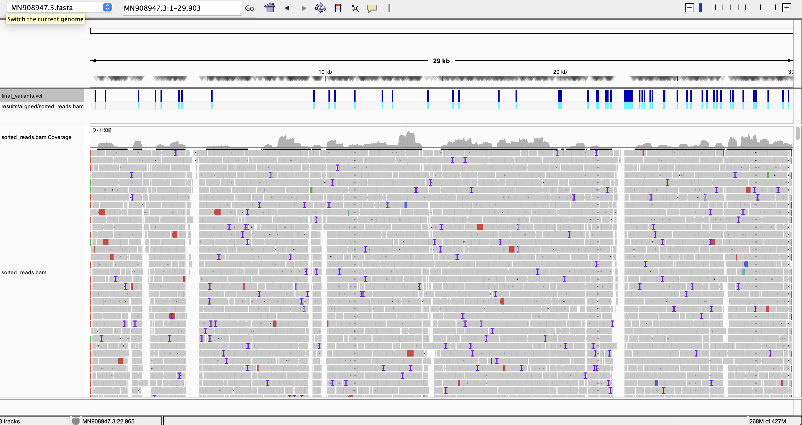

# 🧬 SARS-CoV-2 Variant Hunter

[](https://opensource.org/licenses/MIT)
[](https://pixi.sh)
[](https://pixi.sh)

A bioinformatics pipeline for detecting genomic variants in SARS-CoV-2 samples using next-generation sequencing (NGS) data. This automated workflow performs quality control, read alignment, and variant calling to identify mutations in viral samples.

## 📋 Overview

This pipeline processes paired-end Illumina sequencing reads to identify single nucleotide polymorphisms (SNPs) and insertions/deletions (indels) in SARS-CoV-2 genomes. It uses industry-standard tools for alignment and variant calling, providing high-quality variant calls suitable for epidemiological tracking and research.

## 🎯 Features

- **Automated Workflow**: End-to-end pipeline from raw FASTQ to filtered VCF
- **Reference-based Alignment**: Uses BWA-MEM for accurate read mapping
- **Variant Calling**: BCFtools for SNP and indel detection
- **Quality Filtering**: Removes low-quality variants (QUAL>20, DP>20)
- **Environment Management**: Pixi-managed dependencies for reproducibility

## 🛠️ Tools & Technologies

- **BWA (0.7.19)**: Burrows-Wheeler Aligner for read mapping
- **SAMtools (1.23)**: BAM file manipulation and indexing
- **BCFtools (1.23)**: Variant calling and filtering
- **SeqKit (2.12.0)**: FASTQ/FASTA toolkit
- **Pixi**: Modern package manager for reproducible environments

## 📂 Project Structure

```
sars-cov2-variant-hunter/
├── README.md                    # Project documentation
├── LICENSE                      # MIT License
├── CONTRIBUTING.md              # Contribution guidelines
├── pipeline.sh                  # Main analysis pipeline
├── analyze_results.sh           # Results analysis helper script
├── pixi.toml                    # Dependency management
├── .gitignore                   # Git ignore rules
├── data/
│   ├── reference/
│   │   └── MN908947.3.fasta    # SARS-CoV-2 reference genome (Wuhan-Hu-1)
│   └── raw_fastq/
│       ├── *_R1_001.fastq.gz   # Forward reads
│       └── *_R2_001.fastq.gz   # Reverse reads
├── results/
│   ├── aligned/
│   │   ├── aligned_reads.bam   # Raw alignment
│   │   ├── sorted_reads.bam    # Sorted alignment
│   │   └── sorted_reads.bam.bai # BAM index
│   └── vcf/
│       ├── raw_variants.vcf    # Unfiltered variants
│       └── final_variants.vcf  # High-quality variants
└── docs/
    ├── images/
    │   └── igv-sars-cov2-variant.png  # IGV visualization
    ├── USAGE.md                 # Detailed usage guide
    ├── SAMPLE_REPORT.md         # Example analysis report
    └── EXAMPLE_OUTPUT.md        # Sample pipeline outputs
```

## 🚀 Quick Start

### Prerequisites

- Linux or macOS
- [Pixi](https://pixi.sh) package manager

### Installation

1. **Clone the repository**:
```bash
git clone https://github.com/NasirNesirli/sars-cov2-variant-hunter.git
cd sars-cov2-variant-hunter
```

2. **Install dependencies with Pixi**:
```bash
pixi install
```

3. **Download reference genome**:
```bash
curl -o data/reference/MN908947.3.fasta \
  "https://eutils.ncbi.nlm.nih.gov/entrez/eutils/efetch.fcgi?db=nuccore&id=MN908947.3&rettype=fasta&retmode=text"
```

4. **Download example FASTQ files** (or place your own in `data/raw_fastq/`):
```bash
# Create the directory
mkdir -p data/raw_fastq

# Option 1: Download from ENA (European Nucleotide Archive) - Direct download
# Example: ERR4145453 - SARS-CoV-2 sample
curl -L ftp://ftp.sra.ebi.ac.uk/vol1/fastq/ERR414/003/ERR4145453/ERR4145453_1.fastq.gz -o data/raw_fastq/sample_R1.fastq.gz
curl -L ftp://ftp.sra.ebi.ac.uk/vol1/fastq/ERR414/003/ERR4145453/ERR4145453_2.fastq.gz -o data/raw_fastq/sample_R2.fastq.gz

# Option 2: Download from SRA using sra-tools
# Install sra-tools: pixi add sra-tools
# Example: SRR11772204 - SARS-CoV-2 clinical sample
# pixi run fasterq-dump --split-files -O data/raw_fastq/ SRR11772204
# pixi run gzip data/raw_fastq/SRR11772204_*.fastq

# Option 3: Use your own FASTQ files
# Place paired-end FASTQ files in data/raw_fastq/
# Update the FASTQ variables in pipeline.sh to match your filenames
```

### Running the Pipeline

Execute the complete analysis pipeline:

```bash
pixi run bash pipeline.sh
```

**Note**: Update the FASTQ filenames in `pipeline.sh` if your files have different names.

## 📊 Pipeline Workflow

The pipeline executes the following steps:

### 1. Setup & Indexing
- Creates output directories
- Indexes the reference genome with BWA

### 2. Read Alignment
- Aligns paired-end reads to reference genome using BWA-MEM
- Converts SAM to BAM format

### 3. BAM Processing
- Sorts reads by coordinate
- Creates BAM index for efficient access

### 4. Variant Calling
- Generates pileup of aligned reads
- Calls variants with BCFtools

### 5. Variant Filtering
- Filters for high-quality variants:
  - Quality score (QUAL) > 20
  - Read depth (DP) > 20

## 📈 Example Results

After running the pipeline, you'll find:

### Alignment Statistics
```bash
# Check alignment summary
pixi run samtools flagstat results/aligned/sorted_reads.bam
```

### Variant Summary
```bash
# Count variants
pixi run grep -v "^#" results/vcf/final_variants.vcf | wc -l
```

### Sample Output
The pipeline identifies variants like:

| Position | Ref | Alt | Quality | Depth | Type |
|----------|-----|-----|---------|-------|------|
| 241      | C   | T   | 225.4   | 50    | SNP  |
| 3037     | C   | T   | 225.4   | 217   | SNP  |
| 11287    | GTCTGGTTTT | G | 228.4 | 222 | INDEL |
| 14408    | C   | T   | 228.3   | 37    | SNP  |

### Visualization in IGV

Visualization of aligned reads and detected variants in Integrative Genomics Viewer (IGV):



*The IGV screenshot shows the alignment coverage across the SARS-CoV-2 genome with detected variants highlighted. You can load the BAM files into IGV for interactive exploration of your results.*

## 🔬 Reference Genome

**Accession**: MN908947.3  
**Organism**: Severe acute respiratory syndrome coronavirus 2 (SARS-CoV-2)  
**Isolate**: Wuhan-Hu-1  
**Length**: 29,903 bp

This is the original reference genome sequenced in December 2019 and serves as the standard reference for SARS-CoV-2 variant analysis.

## 📖 Usage Examples

### Run with custom FASTQ files
```bash
# Edit pipeline.sh to update file paths, then run:
pixi run bash pipeline.sh
```

### View specific variant
```bash
# First, compress and index the VCF file
pixi run bgzip -c results/vcf/final_variants.vcf > results/vcf/final_variants.vcf.gz
pixi run tabix -p vcf results/vcf/final_variants.vcf.gz

# Then query specific positions
pixi run bcftools view -r MN908947.3:14408 results/vcf/final_variants.vcf.gz
```

### Extract high-impact variants
```bash
pixi run bcftools view -i 'QUAL>100 && DP>100' results/vcf/final_variants.vcf
```

### Get quality statistics
```bash
pixi run bcftools stats results/vcf/final_variants.vcf > variant_stats.txt
```

### Quick analysis summary
```bash
# Run the analysis helper script for a complete summary
bash analyze_results.sh
```

##  License

This project is licensed under the MIT License - see the [LICENSE](LICENSE) file for details.

## 👤 Author

**Nasir Nesirli**  
📧 Email: nasir.nesirli@gmail.com  
💼 GitHub: [@NasirNesirli](https://github.com/NasirNesirli)

## 🙏 Acknowledgments

- Reference genome source: [NCBI GenBank](https://www.ncbi.nlm.nih.gov/nuccore/MN908947.3)
- Sample data: [SARS-CoV-2 FASTQ samples on Figshare](https://figshare.com/articles/dataset/SARS-CoV-2_fastq_samples/24556747)
- Tools: BWA, SAMtools, BCFtools development teams

## 📚 Resources

- [BWA Manual](http://bio-bwa.sourceforge.net/bwa.shtml)
- [SAMtools Documentation](http://www.htslib.org/doc/samtools.html)
- [BCFtools Documentation](http://www.htslib.org/doc/bcftools.html)
- [SARS-CoV-2 Variants](https://www.who.int/activities/tracking-SARS-CoV-2-variants)

---

**Note**: This pipeline is designed for research purposes. For clinical diagnostics, please consult appropriate regulatory guidelines and validation procedures.
